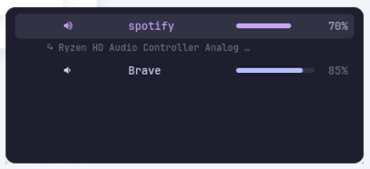
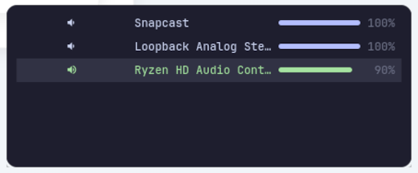

# vol-ctl

Per-app volume OSD for Wayland (niri + PipeWire)
Styled like waybar/Catppuccin Mocha (matching my waybar)

I did not squash but please DO NOT check the commit history it is embarrassing

why would you use it?

first because you are here, second I did not use unholy `pactl` or other
legacy stuff, third because just because

<!-- markdownlint-disable MD033 -->
<table border="0">
  <tr>
    <td></td>
    <td></td>
  </tr>
</table>
<!-- markdownlint-enable MD033 -->

## System dependencies

```bash
sudo apt install libgtk4-layer-shell0 gir1.2-gtk4layershell-1.0 gir1.2-gtk-4.0
```

> PyGObject (`gi`) links against system GTK4 libraries and cannot be fully
> isolated in a virtualenv. `uv tool install` will install it, but it still
> needs the system headers/libs above to actually work.

## Install

### wihtout cloning

- without osd

  ```bash
  uv tool install https://github.com/youssefadly237/vol-ctl.git
  ```

- with osd

  ```bash
  uv tool install "vol-ctl[osd] @ git+https://github.com/youssefadly237/vol-ctl.git"
  ```

### clone and install locally

- without osd

  ```bash
  uv tool install .
  ```

- with osd

```bash
uv tool install ".[osd]"
```

This installs two commands: `vol-osd` (daemon) and `vol-ctl` (controller).

`vol-ctl` works without GTK by default (audio + CLI only).
To show OSD after a command, pass `--osd`:

```bash
vol-ctl --osd raise
vol-ctl --osd sink-mute
```

### niri keybinds

`vol-ctl` is not niri specific, I am just a niri user so I included this

Copy `vol-ctl-wrapper.sh` to `~/.scripts/`, then use `spawn-sh`:

```kdl
binds {
    // knob - adjust focused app
    XF86AudioRaiseVolume { spawn-sh "~/.scripts/vol-ctl-wrapper.sh raise"; }
    XF86AudioLowerVolume { spawn-sh "~/.scripts/vol-ctl-wrapper.sh lower"; }
    XF86AudioMute        { spawn-sh "~/.scripts/vol-ctl-wrapper.sh mute"; }

    // Mod+knob - adjust default sink (master volume)
    Mod+XF86AudioRaiseVolume { spawn-sh "~/.scripts/vol-ctl-wrapper.sh sink-raise"; }
    Mod+XF86AudioLowerVolume { spawn-sh "~/.scripts/vol-ctl-wrapper.sh sink-lower"; }
    Mod+XF86AudioMute        { spawn-sh "~/.scripts/vol-ctl-wrapper.sh sink-mute"; }

    // Mod+Shift+knob - cycle between apps
    Mod+Shift+XF86AudioRaiseVolume { spawn-sh "~/.scripts/vol-ctl-wrapper.sh cycle-next"; }
    Mod+Shift+XF86AudioLowerVolume { spawn-sh "~/.scripts/vol-ctl-wrapper.sh cycle-prev"; }

    // Ctrl+Mod+knob - move focused app to next/prev output device
    Ctrl+Mod+XF86AudioRaiseVolume { spawn-sh "~/.scripts/vol-ctl-wrapper.sh sink-next"; }
    Ctrl+Mod+XF86AudioLowerVolume { spawn-sh "~/.scripts/vol-ctl-wrapper.sh sink-prev"; }
}
```

The `vol-ctl-wrapper.sh` script is a wrapper to inject the path . (I find this
easier than bloating the env)

It simply calls `vol-ctl` with the provided arguments and is not required for
normal use.

## vol-ctl commands

| Command        | Effect                                     |
| -------------- | ------------------------------------------ |
| `raise`        | +5% focused app                            |
| `lower`        | -5% focused app                            |
| `mute`         | toggle mute                                |
| `cycle-next`   | select next stream                         |
| `cycle-prev`   | select previous stream                     |
| `sink-next`    | move focused app to next output device     |
| `sink-prev`    | move focused app to previous output device |
| `sink-raise`   | +5% default sink (master)                  |
| `sink-lower`   | -5% default sink (master)                  |
| `sink-mute`    | toggle default sink mute                   |
| `default-next` | cycle default sink to next                 |
| `default-prev` | cycle default sink to previous             |
| `show`         | show OSD only                              |
| `status`       | print status as JSON                       |
| `stream`       | stream status JSON on PipeWire events      |

## vol-osd commands

| Command | Effect       |
| ------- | ------------ |
| `start` | start daemon |
| `kill`  | stop daemon  |
